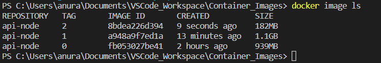
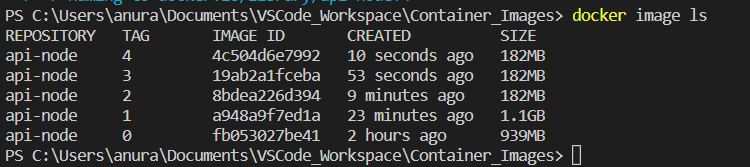
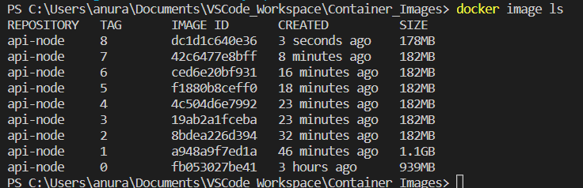

# Version 0
```docker
FROM ubuntu

RUN apt update

RUN apt install nodejs -y
```
# Version 1
```docker
FROM ubuntu

RUN apt update && apt install nodejs npm -y

COPY . .

RUN npm install

CMD ["npm","run","dev"]
```
# Version 2
```docker
FROM node:19.6-alpine # could also be node:latest

COPY . .

RUN npm install

CMD ["npm","run","dev"]
```
The significance is that size is now less.



**It is taking a while to create these images is because we are using COPY command before RUN npm install which is invalidating the cache everytime npm files are downloaded.**

# Version 3

Fix -->
```docker
FROM node:19.6-alpine # could also be node:latest

COPY package.json ./ # now this layer is invalidated if we change our dependencies

RUN npm install

COPY . . # say, if you have a src folder to be copied so you can just write --> COPY ./src .

CMD ["npm","run","dev"]
```

# Version 4
```docker
FROM node:19.6-alpine 

WORKDIR /usr/src/app  # copy things to this path

COPY package.json ./ 

RUN npm install

COPY . .

CMD ["npm","run","dev"]
```



# Version 5

Eventually it will be a production container image, so change npm to node index.js

```docker
FROM node:19.6-alpine 

WORKDIR /usr/src/app  

COPY package.json ./ 

RUN npm install

COPY . .

CMD ["node","index.js"]
```

# Version 6

Security feature -- execute as a non root user

Set the user name to use for running any RUN, CMD, and ENTRYPOINT instructions that follow.

```docker
FROM node:19.6-alpine 

WORKDIR /usr/src/app  

COPY package.json ./ 

RUN npm install

USER node

COPY --chown=node:node . .

CMD ["node","index.js"]
```

# Version 7

environment variables set to production and change npm install to npm ci

```docker
FROM node:19.6-alpine 

WORKDIR /usr/src/app  

ENV NODE_ENV production

COPY package.json ./ 

RUN npm install

USER node

COPY --chown=node:node . .

CMD ["node","index.js"]

```

# Version 8

Add the port number and use a mount (to be used as a cache) to avoid downloading dependencies repeatedly. [Avoiding invalidating the cache.]

```docker
FROM node:19.6-alpine 

WORKDIR /usr/src/app  

ENV NODE_ENV production

COPY package.json ./ 

DOCKER_BUILDKIT = 1

RUN --mount=type=cache,target=/usr/src/app/.npm \
    npm set cache /usr/src/app/.npm && \
    npm ci --only=production

# Now what happens is that mount is added and it is to be used to cache the data.
If I invalidated the previous layer, then it will download all of the dependencies from npm from the Internet and then install them. 

Now it will only download the new dependencies from the Internet and it can use the local cache to install the rest of the dependencies, speeding up the downloads.

USER node

COPY --chown=node:node . .

EXPOSE 8080

CMD ["node","index.js"]

```



<font color="red">Huge Improvements achieved.</font>

