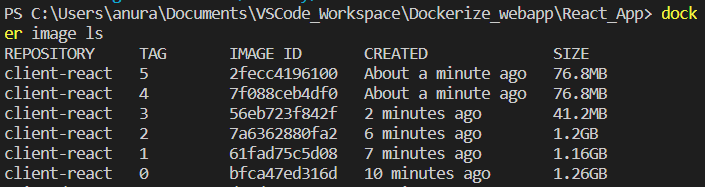

# Version 0

```docker
FROM node

COPY . .

RUN npm install

CMD ["npm","run","dev"]
```

# Version 1

```docker
FROM node:19.4-bullseye

COPY . .

RUN npm install

CMD ["npm","run","dev"]
```

# Version 2

```docker
FROM node:19.4-bullseye

WORKDIR /usr/src/app

COPY package.json ./

RUN npm install

COPY . .

CMD ["npm","run","dev"]
```


# Version 3
```docker
FROM node:19.4-bullseye as build

WORKDIR /usr/src/app

COPY package.json ./

RUN --mount=type=cache,target=/usr/src/app/.npm \
    npm set cache /usr/src/app/.npm && \
    npm install

COPY . .

RUN npm run build

FROM nginx:1.22-alpine

COPY nginx.conf /etc/nginx/conf.d/default.conf

COPY --from=build usr/src/app/dist/ /usr/share/nginx/html

EXPOSE 80
```

# Version 4

Running unprivileged mode for nginx

```docker
FROM node:19.4-bullseye as build

WORKDIR /usr/src/app

COPY package.json ./

RUN --mount=type=cache,target=/usr/src/app/.npm \
    npm set cache /usr/src/app/.npm && \
    npm install

COPY . .

RUN npm run build

FROM nginxinc/nginx-unprivileged:1.23-alpine-perl

COPY nginx.conf /etc/nginx/conf.d/default.conf

COPY --from=build usr/src/app/dist/ /usr/share/nginx/html

EXPOSE 80
```

# Version 5

Running unprivileged mode for nginx in order to work as a non-root user.

```docker
FROM node:19.4-bullseye as build

WORKDIR /usr/src/app

COPY package.json ./

RUN --mount=type=cache,target=/usr/src/app/.npm \
    npm set cache /usr/src/app/.npm && \
    npm install

COPY . .

RUN npm run build

FROM nginxinc/nginx-unprivileged:1.23-alpine-perl

COPY nginx.conf /etc/nginx/conf.d/default.conf

COPY --from=build usr/src/app/dist/ /usr/share/nginx/html

EXPOSE 8080
```

